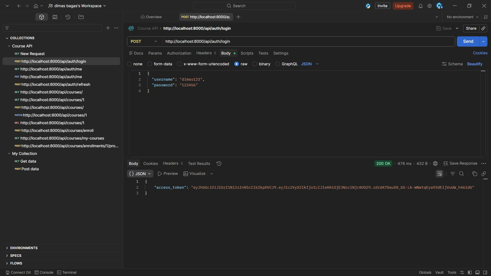

# 🎓 Simple LMS

Simple Learning Management System (LMS) project built with **Django**, **Django Ninja**, **JWT Authentication**, **Docker**, and **PostgreSQL**.

Project ini dikembangkan bertahap dari setup dasar hingga implementasi REST API lengkap dengan authentication dan role-based authorization.

---

## 🚀 Tech Stack

- Django
- Django Ninja
- PostgreSQL
- Docker
- Docker Compose
- JWT (JSON Web Token)
- Pydantic (Schema validation)

---

## 📂 Project Structure

simple-lms/
├── config/
├── courses/
│ ├── migrations/
│ ├── models.py
│ ├── api.py
│ └── ...
├── users/
│ ├── api.py
│ └── ...
├── screenshots/
├── docker-compose.yml
├── Dockerfile
├── .env
├── manage.py
└── README.md

---

## ⚙️ Setup & Run Project

### Clone Repository
git clone https://github.com/Dimas-Bhagaskoro/simple-lms-pss.git
cd simple-lms

### Setup Environment
cp .env.example .env

### Build & Run
docker compose up --build -d

### Migration
docker compose exec web python manage.py migrate

### Create Superuser
docker compose exec web python manage.py createsuperuser

---

## 🌐 Access Application

- Main App: http://localhost:8000  
- Admin Panel: http://localhost:8000/admin  
- API Docs (Swagger): http://localhost:8000/api/docs  

---

## ✅ Features

### 🔹 Progress 1
- Dockerized Django app
- PostgreSQL integration
- Environment configuration

### 🔹 Progress 2
- Custom User model (Admin / Instructor / Student)
- Category & Course management
- Lesson system
- Enrollment system
- Progress tracking
- Query optimization (`select_related`, `prefetch_related`)

### 🔹 Progress 3 (REST API)

#### 🔐 Authentication (JWT)
- `POST /api/auth/register`
- `POST /api/auth/login`
- `POST /api/auth/refresh`
- `GET /api/auth/me`
- `PUT /api/auth/me`

---

#### 📚 Courses API

**Public**
- `GET /api/courses`
- `GET /api/courses/{id}`

**Protected**
- `POST /api/courses` (Instructor)
- `PATCH /api/courses/{id}` (Owner)
- `DELETE /api/courses/{id}` (Admin)

---

#### 🎓 Enrollment API

- `POST /api/courses/enroll`
- `GET /api/courses/my-courses`
- `POST /api/courses/enrollments/{id}/progress`

---

## 🛡️ Authentication System

- JWT Access Token
- Token validation middleware
- Password hashing (Django default)

Gunakan header berikut untuk endpoint protected:

---

## 🔐 Role-Based Access Control (RBAC)

- **Admin** → bisa delete course
- **Instructor** → bisa create & update course
- **Student** → bisa enroll & akses course

---

## 📑 API Documentation

Swagger UI tersedia di:
http://localhost:8000/api/docs

---

## 🧪 API Testing (Postman)

API telah diuji menggunakan Postman.

Collection berisi:
- Auth (login, register, me)
- Courses (CRUD)
- Enrollment
- Progress tracking

---

## 📸 Screenshots

### Swagger Documentation

### Login (JWT Token)

### Courses API

---

## ⚡ Query Optimization

Menggunakan `select_related()` dan `prefetch_related()` untuk menghindari N+1 query problem.

| Scenario | Query | Total |
|----------|------|------|
| Default | Course.objects.all() | Multiple |
| Optimized | Course.objects.for_listing() | 1 |

